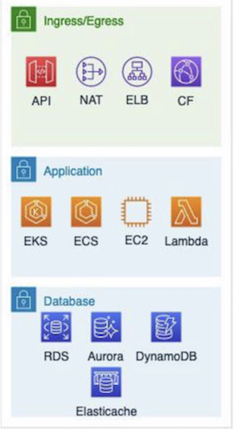
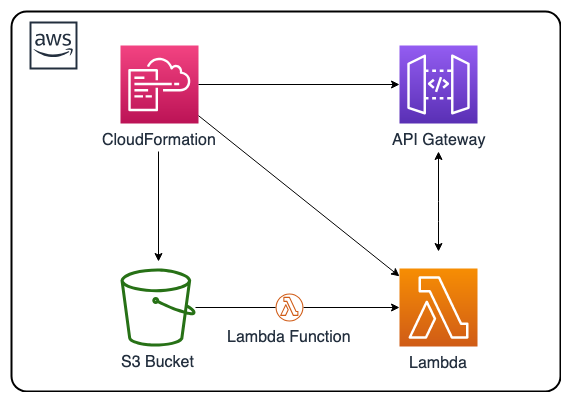

# AWS CloudFormation Templates

This repository contains a collection of CloudFormation templates designed to help you kickstart the deployment of various solutions on the Amazon Web Services (AWS) cloud platform. Whether you are new to AWS or an experienced user, these templates provide a solid foundation for provisioning resources and configuring services in a repeatable and automated manner.

## Getting Started

To get started with using the templates in this repository, follow the steps below:

1. **Clone the Repository**: Begin by cloning this repository to your local machine using the following command:

```bash
git clone https://github.com/HealthTechSG/IaC-Templates.git
```

2. **Navigate to the Templates**: Change into the cloned repository directory:

```bash
cd cf-templates
```

3. **Choose a Template**: Browse through the available templates and select the one that suits your requirements. Each template is located in its respective directory along with any required supporting files.

4. **Deploy the Template**: To deploy the selected template, use the AWS Management Console, AWS CLI, or any other preferred method for deploying CloudFormation templates. Make sure you have the necessary AWS credentials configured on your system.

5. **Customize the Template**: Some templates may require customization before deployment. Open the template file using a text editor and modify the necessary parameters or resource configurations according to your needs. Detailed instructions are usually provided within the template files themselves or in accompanying documentation.

6. **Execute the Deployment**: Execute the deployment command appropriate for your chosen deployment method. For example, if you are using the AWS CLI, you can use the following command:

```bash
aws cloudformation create-stack --stack-name my-stack --template-body file://path/to/template.yaml --parameters ParameterKey=KeyPairName,ParameterValue=my-keypair
```
Replace `my-stack` with your desired stack name, `path/to/template.yaml` with the path to the selected template file, and `KeyPairName` and `my-keypair` with any required parameters and their values.

7. **Monitor the Deployment**: Once the deployment command completes, monitor the progress of the stack creation in your chosen deployment method. You can check the AWS Management Console, use the AWS CLI, or utilize AWS SDKs for programmatic access.

8. **Validate the Solution**: After the stack creation is complete, validate that the deployed solution is functioning as expected. Refer to the documentation or specific instructions provided with the template for guidance on how to test and verify the solution.

## CloudFormation Templates

1. **Generic all stack templates**\
This is a generic template with common AWS components in a multi-tier solution.


2. **Serverless API service**\
This AWS CloudFormation solution deploys a simple AWS serverless example endpoint application.


## Disclaimer

The templates provided in this repository are offered as examples and should be used at your own risk. It is recommended to review and modify these templates to fit your specific requirements and follow AWS best practices before deploying them in a production environment.

## Resources

- [AWS CloudFormation Documentation](https://docs.aws.amazon.com/cloudformation)
- [AWS Management Console](https://console.aws.amazon.com)
- [AWS CLI Documentation](https://awscli.amazonaws.com/v2/documentation)
- [AWS SDKs](https://aws.amazon.com/tools/)
